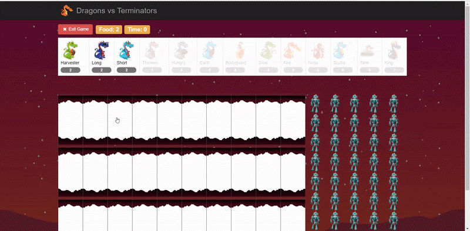

# Dragons and Terminators
 Course Project for Python and OOP Concepts - 10xiitian IB Hubs.
 
 
 
 Dragons vs Terminators is a tower defense game where the goal is to defend the Dragon's territory by obstructing the Terminators.
 
 ## Storyline of the game
 - The Terminator Robots are trying to steal the Dragon Eggs and the heart of the Dragon King
 - Dragons win if all the Terminators are destroyed
 - Terminators win if they reach the end of the tunnel or kill the Dragon King
 - You are expected to place different types of Dragons in the path to protect the Dragon Colony and destroy the Terminators!
 
## Dragon Descriptions
| Dragon | Food Cost | Armor | Damage | Description |
| ------ | --------- | ----- | ------ | ----------- |
| Harvester Dragon | 2 | 1 | 0 | A Harvester Dragon add one food to the colony in every time unit. |
| Thrower Dragon | 3 | 1 | 1 | A Thrower Dragon that throws stones and damages the first Terminator in front of it that is still not in the Skynet. |
| Long Thrower | 2 | 1 | 1 | A cheaper version of Thrower Dragon that throws stones and damages the first Terminator in front of it that is still not in the Skynet and is atleast 5 places away from it's position.|
| Short Thrower | 2 | 1 | 1 | A cheaper version of Thrower Dragon that throws stones and damages the first Terminator in front of it that is still not in the Skynet and is atmost 3 places away from it's position. |
| Fire Dragon | 5 | 3 | x | A special type of Dragon which does damage when it recieves damage. If it is damaged by 'x' armor units and does not die, it does a damage of 'x' armor units to all the terminators in it's place(reflected damage). If it dies, it does an additional amount of damage, which is by default 3. |
| Hungry Dragon | 5 | 3 | x | A Hungry Dragon will select a random Terminator for it's place and eat it whole. After eating a Terminator, it must spend 3 turns digesting before eating again. If no terminator is available, it does nothing. |
| Ninja Dragon | 5 | 1 | 1 | A Ninja Dragon does not block the path of a Terminator that flies by. However, it damages all the Terminators the fly past it. |
| Earth Dragon | 4 | 4 | 0 | An Earth Dragon does nothing each turn. However, it is useful especially because of it's large armor value, which blocks the Terminators. |
| Bodyguard Dragon | 4 | 2 | 0 | A Bodyguard Dragon can contain another Dragon and protect it all in one place, while doing nothing by itself. Any damage by Terminator to a Dragon contained by Bodyguard Dragon will damage the Bodyguard Dragon. |
| Tank Dragon | 6 | 2 | 0 | A Tank Dragon is an advanced type of Bodyguard Dragon which damages all the Terminators in it's place by 1, alongwith benefits of Bodyguard Dragon. |
| Scuba Thrower | 6 | 1 | 1 | A Scuba Thrower is a subclass of Thrower Dragon which is more costly, but is watersafe i.e can be deployed on Water. Otherwise it is identical to Thrower Dragon. |
| Dragon King | 7 | 1 | 1 | The Dragon King is a waterproof Scuba Thrower, that inspires his fellow dragons through his bravery. The Dragon King doubles the damage of all dragons behind him each time he performs an action. Once a dragon's damage has been doubled, it is not doubled again for subsequent turns. However, with great power comes great responsibility. Dragon King has three special rules. Firsly, If the Dragon King dies, the Terminators win, apart from winning from reaching the end of tunnel. Secondly, There can be only one true King. Any King instantiated beyond the first one is impostor, and is destroyed as soon as it takes it's first action. Lastly, The True King cannot be removed once placed. | 
| Slow Thrower | 4 | 1 | 0 | The Slow Thrower is a special type of Thrower Dragon that does no damage but applies a slow effect on a nearest Terminator for 3 turns(stackable). The slow effect makes Terminators perform their original action on even colony times and nothing for odd ones. |
| Scary Thrower | 6 | 1 | 0 | The Scary Thrower is a special type of Thrower Dragon that does no damage but applies a scare effect on a nearest Terminator for 2 turns(non stackable). The scare effect makes the Terminators go backwards instead of forward. Once a Terminator has been scared, it cannot be scared again thereafter. |
| Laser Dragon | 10 | 1 | x | A Thrower Dragon with a twist. A Laser Dragon shoots a powerful laser, damaging all that dare stand in its path, friend or foe. When a Laser Dragon takes action, it will damage all Fighters(Dragons or Terminators) in it's place and all places in front of it. A Laser Dragon has a base damage of 2, but it's damage is weakened by 0.2 each place away from it's position. Also, each time a Laser Dragon damages a Fighter(Dragon or Terminator), it's total damage is reduced by 0.05. |
